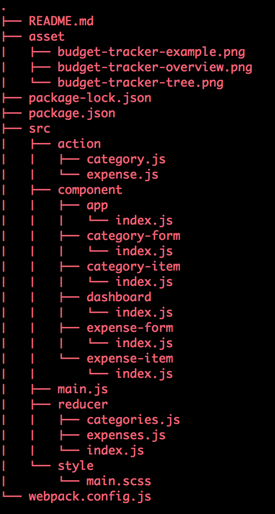
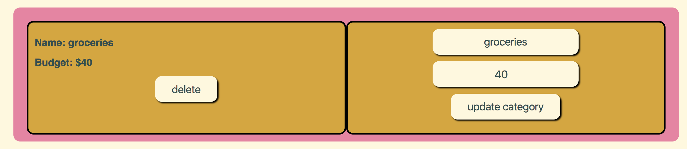

# Code Fellows: Seattle 401 JavaScript - 401d19

## Lab 31-34: Budget Tracker

### Author: 
Catherine Looper

### Motivation

In this project, I built a frontend Budget Tracker application. To create a new budget item, users can enter a name and a budget amount and click `create category`. Users can update a budget item by editing the information on the right-hand side of the corresponding budget item and clicking `update category`. Users also have the ability to remove any of their created budget items by clicking the `delete` button next to the budget item they would like to remove. 

Users can also add expenses to each category by entering an expense `name` and `price` and clicking the `create expense` button. Users can edit information and click `update expense` to update, and `delete` to remove the expense from the category.

In this application, I configured webpack to compile JavaScript and SASS into a bundle and configured babel to transpile JSX and ES6 to ES5 JavaScript. I was able to create and render React components to the DOM, add event listeners to React components, and update React component state.

### Build

#### Sample Budget View:

### Limitations

To use this app - it is assumed that the user has familiarity with the tech and frameworks listed below.

### Code Style

Standard JavaScript with ES6, SASS, CSS, HTML, React

### Tech/Framework Used

* babel-core
* babel-loader
* babel-plugin-transform-object-rest-spread
* babel-preset-env
* babel-preset-react
* css-loader
* eslint-plugin-react
* extract-text-webpack-plugin
* html-webpack-plugin
* node-sass
* react
* react-dom
* react-redux
* react-router-dom
* redux
* redux-devtools-extension
* resolve-url-loader
* sass-loader
* superagent
* uuid
* webpack
* webpack-dev-server
* eslint

### How to use?

* Step 1. Fork and Clone the Repository.
* Step 2. `npm install`
* Step 3. `npm run watch`
* Step 4. You should now be able to visit: `http://localhost:8080/` to view the application
* Step 5. To create a new budget item, enter a name and a budget amount and click the `create category` button. 
* Step 6. Budget categories can be edited by changing the information on the right hand side and clicking the `update category` button. 
* Step 7. Budget items can be removed by clicking the corresponding `delete` button.
* Step 8. To create a new expense item, enter a name and a price and click the `create expense` button. Expenses can be updated with `update expense` or they can be deleted by clicking `delete`.

### Credits

* Code Fellows

### License

MIT © Catherine Looper

